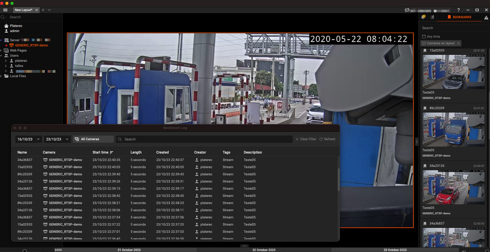

# Connect Stream to you VMS (based on NX Witness)

With our integration, you can send **Stream** detection events to your VMS server via a webhook. This way, bookmarks with detection information are saved on the timeline. Later, you can search for the detections and locate the timeline where the detection occurred, view, or download the detection video.

Our integration is not limited to NX Witness; it also supports **Wisenet Wave** and **DW Spectrum**. This expanded support enables you to connect your surveillance system with even more versatility and efficiency.




## **Installation**

### 1) Install requirements

```bash
pip install Flask requests waitress
```

### 2) Start the server

```bash
python3 main.py <parameter>

# For example:
python3 main.py --server_host "https://192.168.5.10:7001" --port 5001 --login admin --password admin123
```

Required parameters:
- --login
- --password

Optional parameters:
- --port
- --debug
- --ssl

For external access

- --host=0.0.0.0 (default)

### 4) Configure and Start Stream

- Set the [Camera-ID](https://guides.platerecognizer.com/docs/stream/configuration#hierarchical-configuration), present in the config.ini configuration file, equal to the VMS-Camera-ID parameter provided by VMS.
- Set the parameter webhook_targets in config.ini to the host and port of your webhook.

```ini
# List of TZ names on https://en.wikipedia.org/wiki/List_of_tz_database_time_zones
timezone = UTC

[cameras]
  # Full list of regions: http://docs.platerecognizer.com/#countries
  regions = gb
  image_format = $(camera)_screenshots/%y-%m-%d/%H-%M-%S.%f.jpg

  webhook_targets = http://192.168.5.10:5001

  [[VMS-Camera-id-1]]
    active = yes
    url = rtsp://192.168.0.110:8080/video/h264
  [[VMS-Camera-id-N]]
    active = yes
    url = rtsp://192.168.0.120:8080/video/h264
```

The example above shows the config.ini set up with the previously running webhook and two cameras with their respective RTSP links and their camera_ID. This same configuration can be used for multiple cameras.

After modifying the config.ini, restart the Stream container.

## Docker Setup

To run the script in a docker container, use the procedure below:

1. Build the image

   ```bash
   docker build --tag platerecognizer/webhook-vms .
   ```

2. Run the image

   ```bash
    example:

    docker run --rm -t -p 5000:5000 --SERVER_HOST "https://192.168.5.10:7001" -e LOGIN=admin -e PASSWORD=admin123 platerecognizer/webhook-vms
    
   ```

## Blacklist/WhiteList with Parkpow
In conjunction with Parkpow, you can choose a TAG so that the VMS can display it and add it as bookmark information. The TAG can define authorized or blocked vehicles, and later it is possible to search for vehicles by the TAG.

The inclusion or exclusion of vehicles in a TAG is done directly in [Parkpow](https://parkpow.com/). The vehicle list is updated every 20 seconds.  

To activate this functionality, add the parameters --tag and --parkpow_token to the execution command.

Required parameters:

- --tag
- --parkpow_token


```bash
example:

docker run --rm -t -p 5000:5000 --SERVER_HOST "https://192.168.5.10:7001" -e LOGIN=admin -e PASSWORD=admin123 -e TAG=Authorized -e PARKPOW_TOKEN=YYYYYYYYYYYYYYYYYYYYYYYYYYYYYYYYYYYYYYY  platerecognizer/webhook-vms

```
